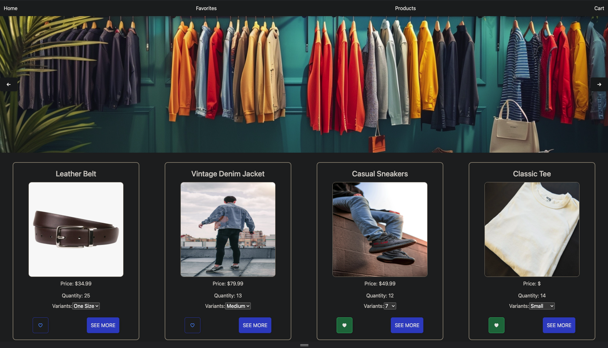
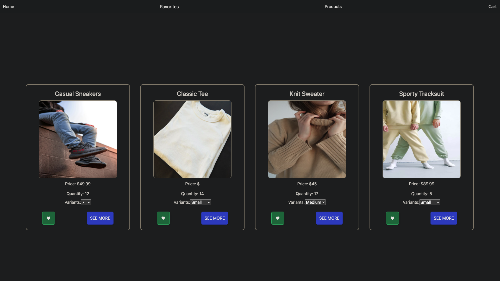
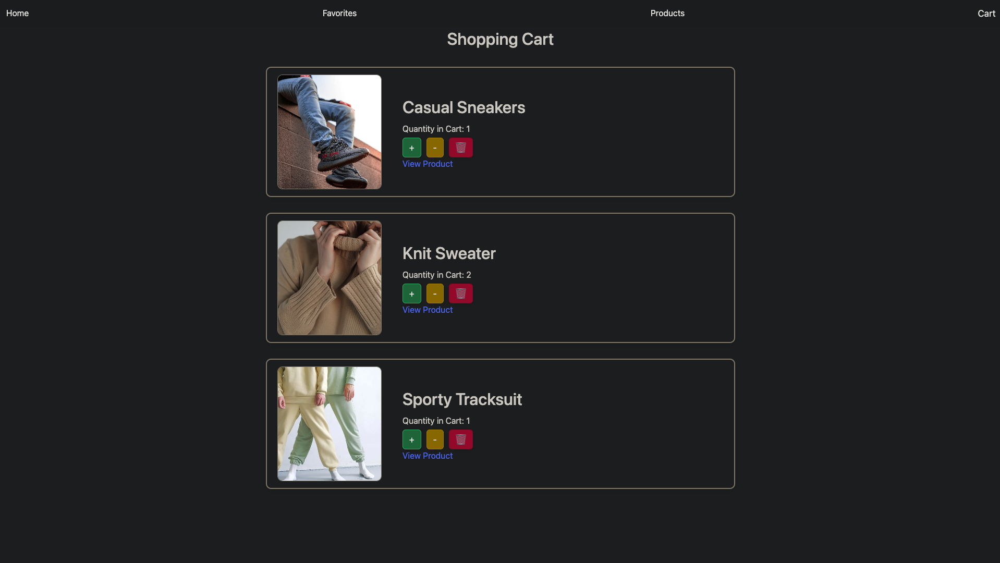

# README BLUEPRINT

# Project Overview
This React-based e-commerce application allows users to view, add, and manage products in a shopping cart using Firestore to store product data. The project focuses on using React framework features like react-router-dom and Firestore integration to build a dynamic e-shop.

# Screenshots

# Table of Contents
- Goals
- How to Use
- Tech Stack
- Implementation
- Code Function & Design Decisions
- Issues & Bugs
- Additions & Improvements

# Goals
The primary goals of this project are to practice fetching data within a React app, navigate using react-router-dom, and manage state and backend interactions through Firestore. Additionally, implementing a functional cart system showcases dynamic data handling and user interaction.

# How to Use / Important Elements
To use this application, navigate using the menu to view products on the home page or access specific product details. Users can add products to the cart, adjust quantities, or remove items. Ensure you have internet connectivity to fetch the latest product data and manage cart contents.

# Tech Stack
This project uses React.js for the frontend framework, Firestore for data management, and react-router-dom for routing. The application styling is enhanced with Bootstrap for responsive layouts.

# Implementation

### MVP (basic requirements)
- Home Page with a grid of products and a carousel for featured products.
- Product Page for individual products, allowing users to add items to the cart and choose variants.

### User Interface
- The UI utilizes Bootstrap for responsive design, ensuring accessibility on different devices and viewport sizes.

### Logic Strategy
- Firestore handles all product data, including stock levels which are checked against the cart contents to prevent over-adding unavailable items.

# Code
The codebase is structured around React components for each page and feature, Firestore queries for data handling, and routing managed by react-router-dom. Components are designed to be reusable and modular.

# Issues / Bugs

# Potential Additions
- New product photos to enhance visual appeal and update product listings.
- Implementing a loading spinner to improve user experience during data fetch operations.
- Integration of a payment system like Stripe to process transactions in test mode.
- Additions of Modals for Specific Products 
- New Component for Favorites Page
- Addition of 'add to cart' link on HomePage and in Favorites
